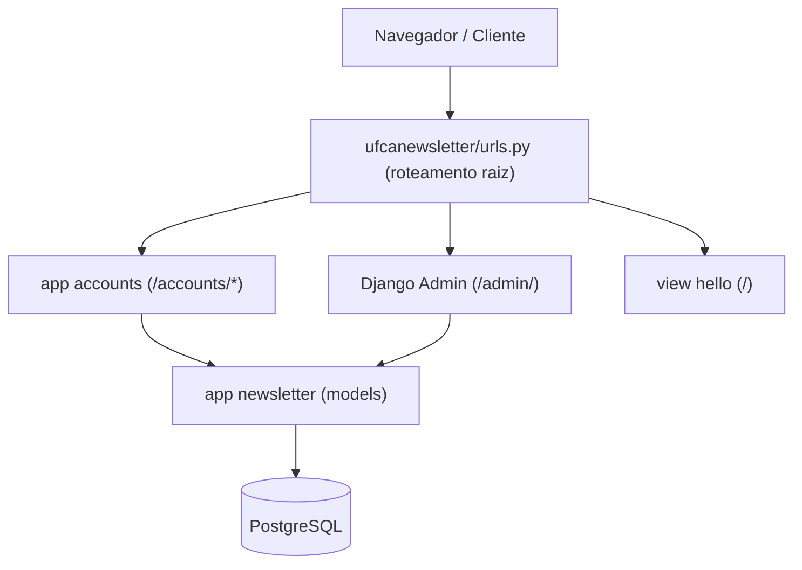
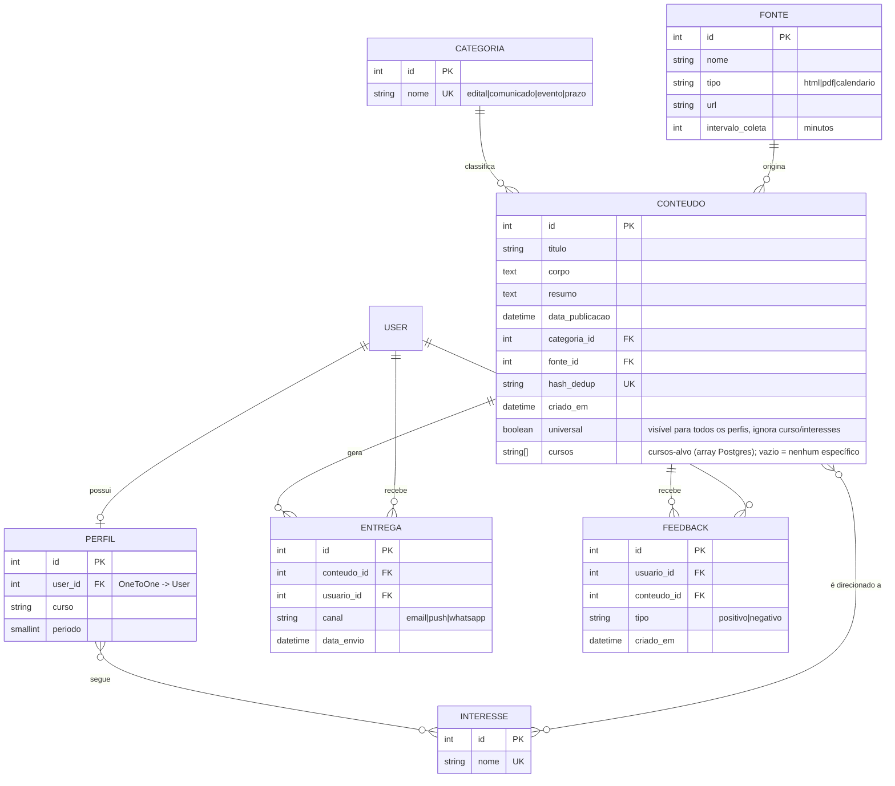

# Arquitetura

## Visão geral

A UFCA Newsletter é uma aplicação **Django** que coleta, classifica e distribui
conteúdos acadêmicos (editais, comunicados, eventos, prazos) de forma
**personalizada** por perfil do estudante. Persistência em **PostgreSQL** e
execução em contêineres via **Docker Compose**.

## Stack

| Componente | Versão | Papel |
|---|---|---|
| Python | 3.12 | Linguagem |
| Django | 6.0.x | Framework web |
| PostgreSQL | 16 | Banco de dados |
| psycopg | 3.2.x | Driver do Postgres |
| requests / beautifulsoup4 / lxml | — | Coleta e parsing (HTML) — uso futuro (FEAT-03) |
| PyMuPDF | 1.27.x | Extração de PDF — uso futuro (FEAT-03) |
| pytest / pytest-django | — | Testes |
| ruff | — | Lint/formatação |

## Estrutura do projeto

```text
app/
├── manage.py
├── ufcanewsletter/        # "projeto" Django (configuração global)
│   ├── settings.py        # configs, INSTALLED_APPS, banco (via env)
│   ├── urls.py            # roteamento raiz
│   ├── wsgi.py / asgi.py  # pontos de entrada do servidor
│   └── views.py           # view "Hello World" (placeholder)
├── newsletter/            # app de DOMÍNIO (modelos das entidades)
│   ├── models.py
│   ├── admin.py
│   └── migrations/
└── accounts/              # app de AUTENTICAÇÃO (cadastro, login, perfil)
    ├── forms.py / views.py / urls.py
    └── templates/
```

- **`ufcanewsletter`** é o *projeto* (a "cola"/configuração) — só existe um.
- **`newsletter`** e **`accounts`** são *apps* (funcionalidades). O sistema pode
  ganhar mais apps conforme as features (ex.: coleta, distribuição).

### Componentes



## Modelo de dados

Entidades centrais (app `newsletter`) e sua relação com o usuário do Django (`auth.User`):



**Notas de integridade:**
- `Perfil.interesses` é N:N com `Interesse` (o aluno escolhe suas tags).
- `Conteudo.categoria` e `Conteudo.fonte` usam `on_delete=PROTECT` (não se apaga
  uma Categoria/Fonte com conteúdos vinculados).
- `Conteudo.hash_dedup` é único → deduplicação de conteúdo coletado.
- `Entrega` é única por (`conteudo`, `usuario`, `canal`); `Feedback` é único por
  (`usuario`, `conteudo`).
- **Personalização do feed** (`Conteudo.universal`, `Conteudo.cursos`,
  `Conteudo.interesses`, ver `newsletter/feed.py`): um conteúdo aparece no feed
  de um `Perfil` se for `universal=True`, **ou** se `Perfil.curso` estiver em
  `Conteudo.cursos`, **ou** se houver interseção entre `Perfil.interesses` e
  `Conteudo.interesses`. Conteúdo não-universal sem curso/interesses associados
  não aparece para ninguém (precisa de direcionamento explícito).

> O diagrama pode ser regenerado a partir do código com
> `django-extensions` (`python manage.py graph_models newsletter`).

## Autenticação (app `accounts`)

- Usa o **auth padrão do Django** (sem modelo de usuário customizado).
- **Cadastro** (`/accounts/signup/`): exige e-mail institucional
  `@aluno.ufca.edu.br`, bloqueia duplicados e **cria automaticamente um
  `Perfil` vazio** para o novo usuário.
- **Login/logout** via `LoginView`/`LogoutView` do Django.
- Distinção de papel: `is_staff` → **administrador**; senão **estudante**.

## Rotas principais

| Rota | Descrição | Acesso |
|---|---|---|
| `/` | Página inicial (placeholder "Hello World") | Público |
| `/admin/` | Django Admin — gestão de todas as entidades | Staff/superusuário |
| `/accounts/signup/` | Cadastro de estudante | Público |
| `/accounts/login/` `/accounts/logout/` | Login / logout | Público / autenticado |
| `/accounts/dashboard/` | Área autenticada de exemplo (mostra o papel) | Autenticado |
| `/accounts/perfil/` | Preenchimento e edição do perfil acadêmico | Autenticado |
| `/feed/` | Feed de conteúdo personalizado (JSON, paginado — `?page=`/`?page_size=`) | Autenticado |
